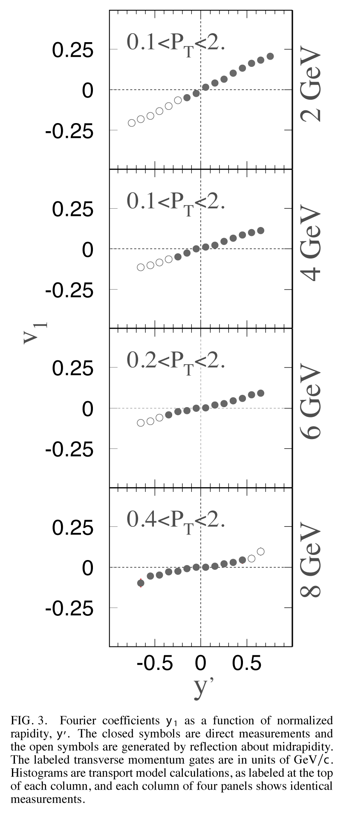
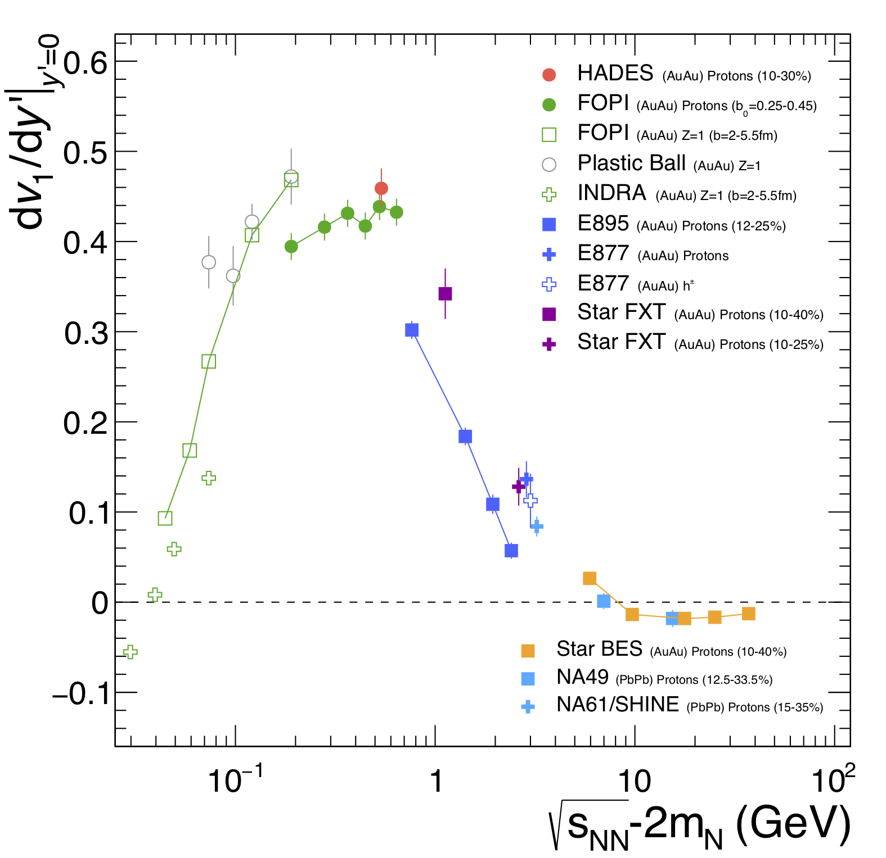

# E895-flow

Phys. Rev. Lett. 84, 5488

https://inspirehep.net/literature/527376
https://journals.aps.org/prl/abstract/10.1103/PhysRevLett.84.5488
https://arxiv.org/abs/nucl-ex/0005005

Fig3 from PRL:

Fig11 from HADES publication:
